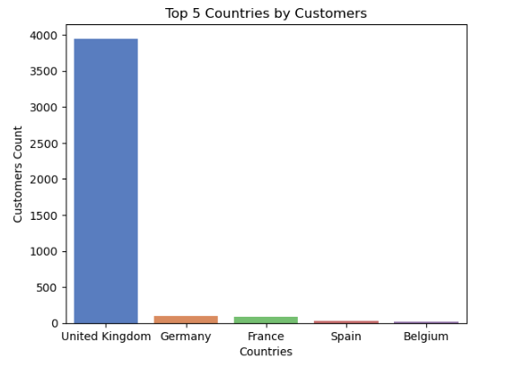
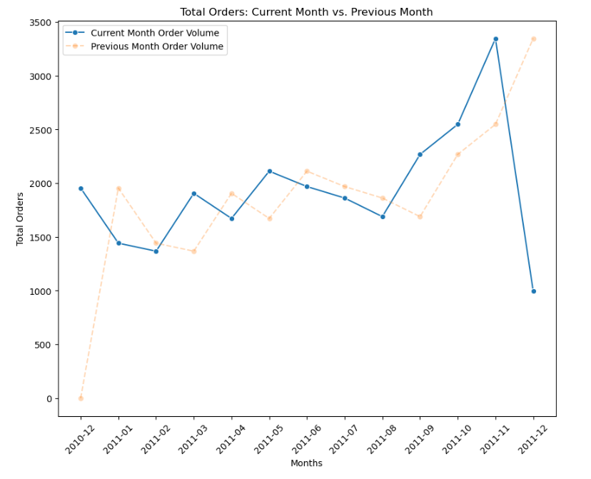
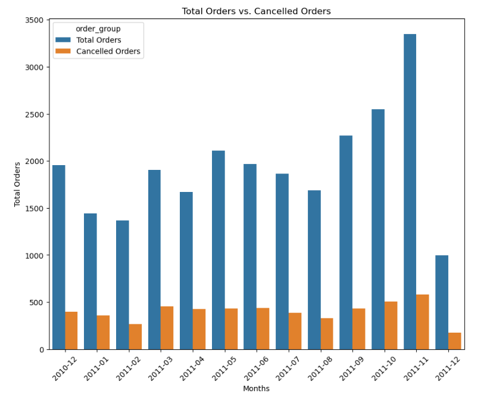
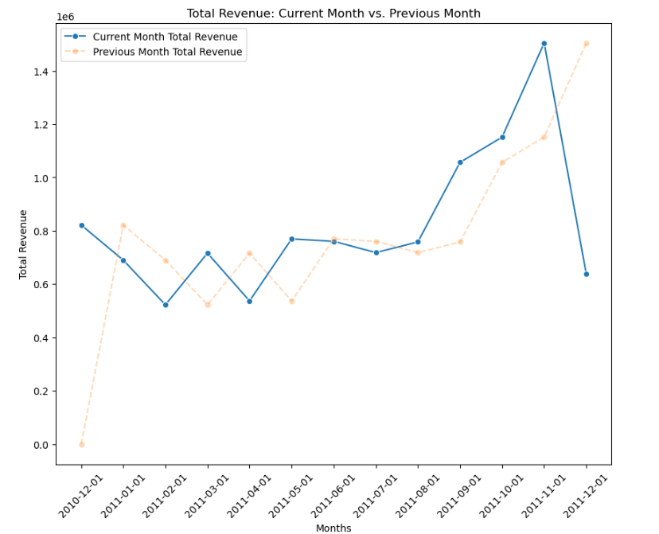
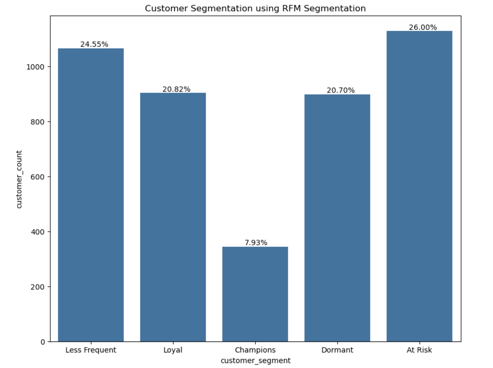
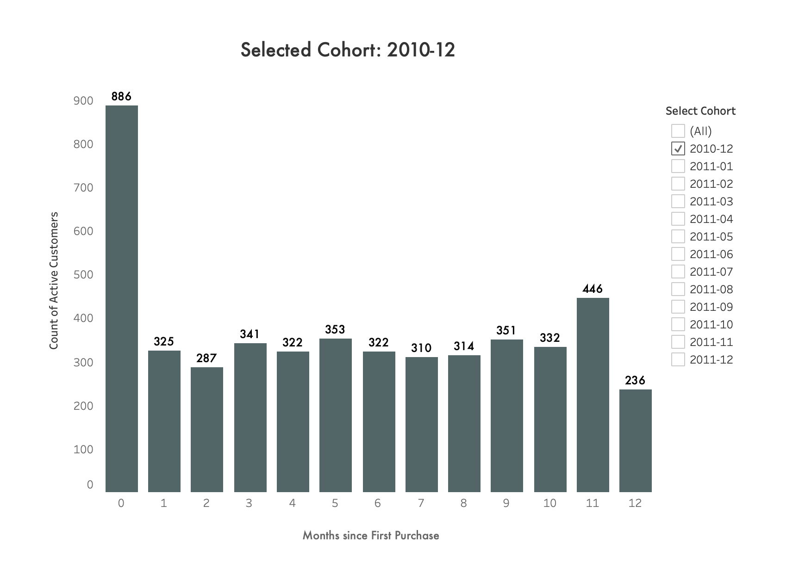

# Case Study: End-to-End Analysis of UCI Online Retail Data

## Introduction

This case study outlines an end-to-end data analysis project using the UCI Online Retail dataset. The primary objective was to transform raw transactional data into actionable business insights through rigorous data cleaning, exploratory analysis, and advanced analytics. The project leveraged SQL for data manipulation and Python (with Pandas, Seaborn, and Matplotlib) for visualization. Key advanced analytical techniques applied include RFM segmentation, cohort analysis, and market basket analysis.

## [Dashboard](https://public.tableau.com/app/profile/paritosh.sharma.ghimire/viz/retail_analysis_dash/DashboardLanding)

## [Data Ingestion and Transformation](preprocessing/load_and_transform/migration_to_normalised_tables.sql)

- **Data Source:**  
  The dataset originated as an XLSX file containing online retail transactions. A Python script was used to convert the XLSX file to CSV, which was then imported into a PostgreSQL staging table.

- **Staging Process:**  
  The raw data was loaded into a staging table where initial transformations were applied. Missing `customer_id` values were imputed with a placeholder (e.g., `00000`) to ensure consistency for downstream analysis.

## [Data Quality Checks and Cleaning](preprocessing/data_quality_check.sql)

- **Duplicate Removal:**  
  Duplicate rows were identified and removed from the staging table to prevent skewing analysis.

- **Handling Cancelled Orders:**  
  Negative quantity values were flagged as cancelled orders. A boolean column (`is_cancelled`) was added to clearly mark these records.

- **Unit Price Corrections:**  
  - Initially, 1,180 rows had a `unit_price` of 0, spread across 683 distinct products.
  - Further investigation revealed that some rows with stock codes such as `M` (Manual), `B` (Adjust bad dept), and `BANK CHARGES` (Bank_charges) were not relevant to consumer transaction analysis.
  - These rows, along with rows where `customer_id` was null, were dropped (1,134 rows removed), leaving 46 rows for further consideration.
  - The remaining rows were filled using mean value imputation strategy.
  - After cleaning, the only remaining instances of `unit_price = 0` were for cancelled orders.
  - Remaining anomalies were imputed using the mean value, ensuring that revenue calculations were accurate.

- **Description Imputation:**  
  For cancelled orders lacking product descriptions, a placeholder value ("cancelled orders do not have description") was used.

- **Date Validation:**  
  All invoice dates were checked for validity, confirming no anomalies in the time dimension.

- **Final Outcome:**  
  The resulting clean dataset in the staging area provided a robust foundation for advanced analytics.

## [Exploratory Data Analysis (EDA)](EDA/eda.ipynb)

### Customer Insights

- **Unique Customer Count:**  
  SQL queries revealed a total of 4,372 unique customers, with a notable 90% hailing from the UK.

  

- **Order Volume Analysis:**  
  By excluding placeholder `customer_id` ('00000'), the analysis showed:
  - Some customers placed hundreds of orders (e.g., customer 14911 placed 248 orders).
  - Statistical measures indicated an average of 5 orders per customer and a median of 3, suggesting a right-skewed distribution.

  

### Invoice and Revenue Analysis

- **Invoice Trends:**  
  Analysis of invoice dates indicated that the sales data spans 1 year and 8 days. Month-over-month order growth metrics highlighted seasonal fluctuations, including notable peaks and declines.

- **Cancellation Metrics:**  
  Overall, 20.58% of orders were cancelled. A deeper month-over-month breakdown revealed a peak cancellation rate of 25.48% in April 2011 and significant variations across the year.

  

- **Revenue Performance:**  
  - Total revenue from non-cancelled orders was calculated at approximately 10.64M.
  - Lost revenue due to cancellations amounted to roughly 894K.
  - Time-series analysis provided insights into revenue trends and highlighted anomalies such as a drastic drop in December 2011.

    

## Advanced Analytics

### [RFM Analysis](Analysis/rfm_analysis.sql)

- **Objective:**  
  Segment customers based on Recency, Frequency, and Monetary values to identify high-value and at-risk segments.
  
- **Methodology:**  
  - Each customer was assigned scores (1-5) for recency (days since last purchase), frequency (number of orders), and monetary (total spending).
  - An overall RFM score was computed by summing the three individual scores.
  - Segments such as "Champions" (5-5-5) and "At Risk" were defined based on these scores.
  
  

  	- “Champions” (7.93%) are your best-performing customers—recent, high frequency, and high spending.
    - “Less Frequent but Loyal” (24.55%) represents customers who consistently return, albeit less frequently.
	- “At Risk” (26.00%) customers might need targeted re-engagement strategies, as they have lower scores in recency, frequency, or monetary value.
    - “Returning and Loyal” (20.82%) and “Dormant” (20.70%) segments provide additional context on customer behavior that can help tailor marketing efforts.
- **Outcome:**  
  This segmentation enabled targeted marketing strategies, allowing the business to focus on loyal customers while designing re-engagement plans for at-risk segments.

### [Cohort Analysis](Analysis/cohert_analysis.sql)

- **Objective:**  
  Group customers by the month of their first purchase to understand retention and loyalty over time.
  
- **Methodology:**  
  - The first purchase date for each customer was determined, and customers were grouped into cohorts based on this date.
  - Subsequent purchase behavior was tracked month-over-month to assess retention.

  
  
- **Outcome:**  
  The cohort analysis provided insights into customer lifetime value and retention trends, identifying periods with higher churn or improved loyalty.

### [Market Basket Analysis](Analysis/cohert_analysis.sql)

- **Objective:**  
  Identify products that are frequently purchased together to uncover cross-selling opportunities.
  
- **Methodology:**  
  - A self-join on the `invoice_items` table was performed, pairing products within the same invoice.
  - A condition (`a.stock_code < b.stock_code`) was applied to ensure each unique product pair was counted only once.
  - Co-occurrence counts were aggregated and filtered to highlight significant product associations.
 
  

  
- **Outcome:**  
  This analysis revealed product pairings that could be used to optimize product recommendations and design bundled promotions.

### Time-Series Analysis & Forecasting

- **Objective:**  
  Forecast future sales trends and understand seasonality
  
- **Methodology:**  
  - Sales data was aggregated on a monthly basis using SQL.
  - The aggregated data was exported and analyzed in Python using libraries such as Pandas, Seaborn, and Matplotlib.
  
- **Outcome:**  
  These predictive insights assist in inventory planning and strategic marketing, preparing the business to anticipate seasonal fluctuations.

## Conclusions & Future Work

This end-to-end analysis of the UCI Online Retail dataset demonstrates the full lifecycle of a data analytics project:

- **Data Cleaning and Transformation:**  
  A rigorous process ensured that the raw data was transformed into a high-quality, normalized dataset.

- **Exploratory Analysis:**  
  EDA revealed key customer behaviors, invoice trends, and revenue patterns.

- **Advanced Analytics:**  
  Through RFM segmentation, cohort analysis, and market basket analysis, actionable insights were derived to inform business strategy.
